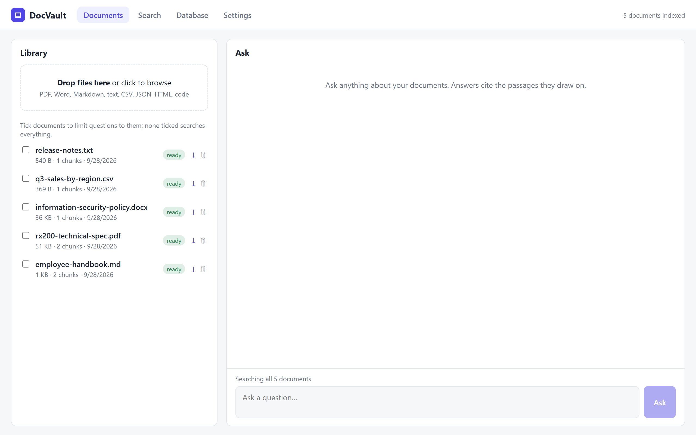
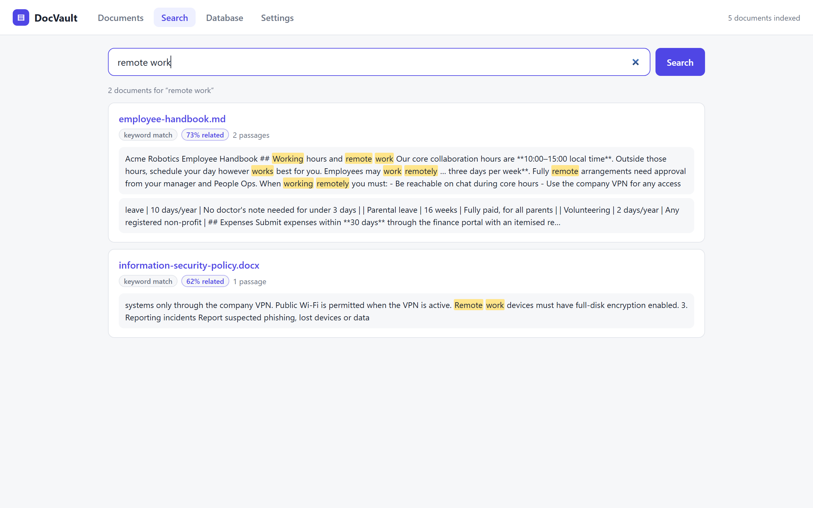
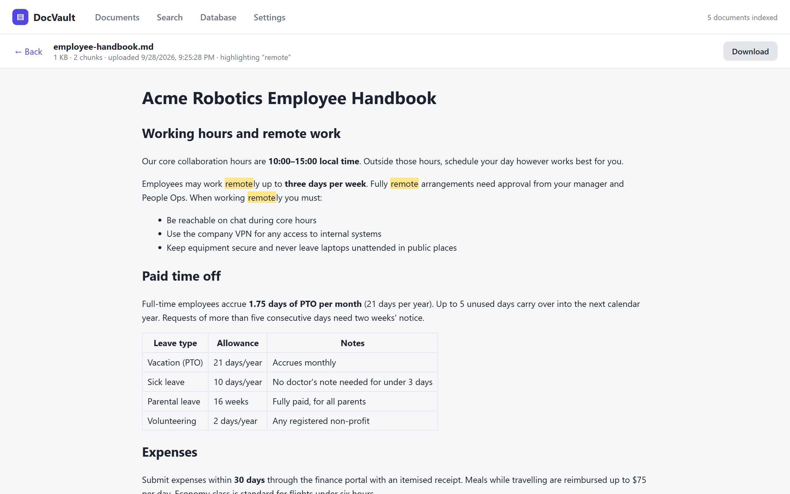
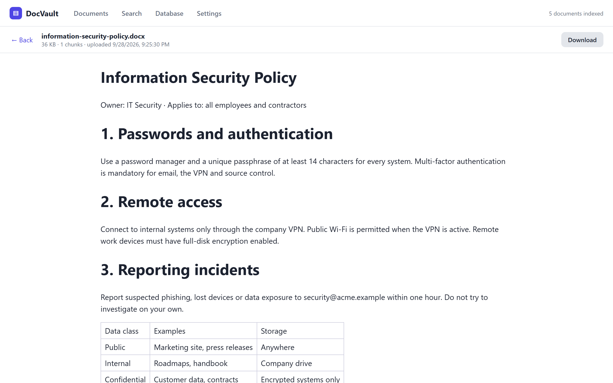
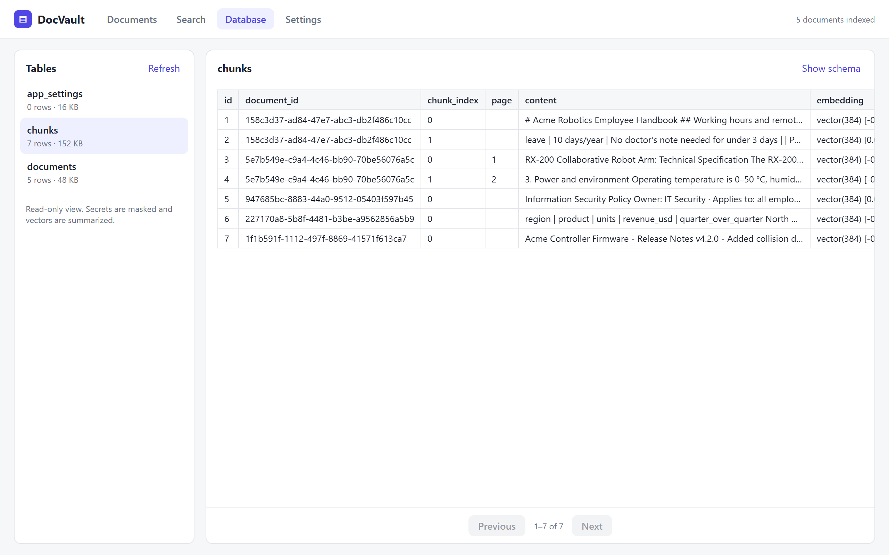
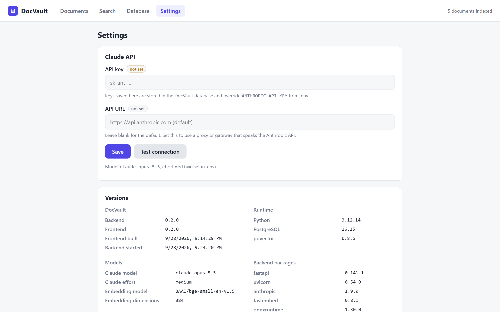

# DocVault

Upload documents, search them, read them in the browser, and ask questions about them. Answers come from Claude and cite the passages they draw on.

- **frontend/**: React + Vite + TypeScript, served by nginx, which also proxies `/api` to the backend
- **backend/**: FastAPI. Extracts text (PDF, DOCX, Markdown/text, CSV, JSON, HTML, code), splits it into chunks, embeds them locally on CPU with fastembed (`BAAI/bge-small-en-v1.5`), stores the vectors in Postgres + pgvector, and streams answers from Claude over SSE
- **postgres**: `pgvector/pgvector:pg16`

Pages:
- **Documents:** upload files, watch indexing, and chat with all documents or a selected subset.
- **Search:** keyword search (Postgres full-text) combined with semantic search (vectors). Results link to the passages they matched.
- **Viewer:** renders PDFs, Word documents, Markdown, CSV tables, text and code, with search terms highlighted.
- **Database:** a read-only table browser showing schema, indexes and rows. Secrets are masked.
- **Settings:** the Anthropic API key and API URL (stored in the database, overriding `.env`), plus the versions of all components.

## Screenshots

**Documents:** upload, indexing status, and chat over the whole library or selected files.



**Search:** keyword and semantic matches, grouped by document.



**Viewer:** documents render in the app with search terms highlighted. Shown here: Markdown and a Word document.





**Database:** read-only table browser.



**Settings:** API key and URL, plus component versions.



<sub>Screenshots use fictional sample documents.</sub>

> **No built-in authentication.** Run DocVault on a private network, or put it behind an auth or IP-allowlist middleware (see `TRAEFIK_MIDDLEWARES` below). Anyone who can reach it can read, upload and delete documents, and change the API key.

## Run locally

```bash
cp .env.example .env     # optionally set ANTHROPIC_API_KEY (or set it later on the Settings page)
docker compose up -d --build
```

Open http://localhost:8080.

## Configuration (`.env`)

| Variable | Default | |
|---|---|---|
| `ANTHROPIC_API_KEY` | (none) | Needed for answers. Uploading, indexing and search work without it. Can also be set on the Settings page. |
| `ANTHROPIC_BASE_URL` | Anthropic API | Proxy or gateway URL. Can also be set on the Settings page. |
| `CLAUDE_MODEL` | `claude-opus-5-5` | |
| `CLAUDE_EFFORT` | `medium` | `low` / `medium` / `high` / `xhigh` / `max` |
| `MAX_UPLOAD_MB` | `100` | |
| `POSTGRES_USER` / `POSTGRES_PASSWORD` / `POSTGRES_DB` | `docvault` | Change the password for anything beyond local use. |
| `DOCVAULT_PORT` | `8080` | Published port when not behind Traefik |

## Deploy

`scripts/deploy.sh` builds and starts the stack on a Docker host. It picks the compose files to use from `.env`:

| Variable | Effect |
|---|---|
| `DEPLOY_DOCKER_CONTEXT` | Docker context to deploy to (e.g. a remote host added with `docker context create --docker host=ssh://user@host`). Defaults to the current context. |
| `DATA_DIR` | Adds `docker-compose.datadir.yml`: data goes in `$DATA_DIR/{db,uploads,models}` on the host instead of named volumes. |
| `DOCVAULT_HOST` | Adds `docker-compose.traefik.yml`: no published port, and the app is served by an existing Traefik at `https://$DOCVAULT_HOST`. Also uses `TRAEFIK_NETWORK` (default `traefik`) and `TRAEFIK_CERTRESOLVER` (default `letsencrypt`). |
| `TRAEFIK_MIDDLEWARES` | Adds `docker-compose.traefik-middlewares.yml`: attaches middlewares (e.g. an IP allowlist or basic auth) to the router. |

```bash
scripts/deploy.sh            # deploys only if files changed since the last successful deploy
scripts/deploy.sh --force
```

The script waits for the backend's health check. On the first start this takes a minute or two while the embedding model downloads.

**Auto-deploy with Claude Code:** `.claude/settings.json` registers a Stop hook (`scripts/claude-stop-hook.sh`). After each Claude turn it runs the deploy in the background; when nothing changed, the deploy does nothing. If a deploy fails, the output from `.deploy.log` is sent back to Claude to fix. Delete the hook if you don't want this.

## API

| | |
|---|---|
| `GET /api/health` | |
| `GET /api/documents` | List documents with status (`processing` / `ready` / `failed`) |
| `POST /api/documents` | Multipart `file`; a file with identical content returns the existing record |
| `GET /api/documents/{id}` | Document metadata |
| `GET /api/documents/{id}/file` | Download the original (`?inline=1` displays PDFs and images in the browser) |
| `GET /api/documents/{id}/preview` | Renderable preview (`pdf` / `html` / `markdown` / `table` / `code` / `text`) |
| `POST /api/documents/{id}/reprocess` | |
| `DELETE /api/documents/{id}` | |
| `GET /api/search?q=` | Keyword and semantic search, grouped by document |
| `POST /api/chat` | `{question, history?, document_ids?}` returns an SSE stream: `sources`, then `delta`s, then `done` or `error` |
| `GET /api/settings`, `PUT /api/settings`, `POST /api/settings/test` | API key (never returned in full) and API URL |
| `GET /api/versions` | Component versions |
| `GET /api/db/tables`, `GET /api/db/tables/{name}/rows` | Read-only database browser |

## Limitations

- Scanned PDFs (images with no text layer) can't be indexed; there's no OCR.
- Semantic search uses a small CPU embedding model, so a query unrelated to any document may still return its closest match, labelled with a low "% related" score.
